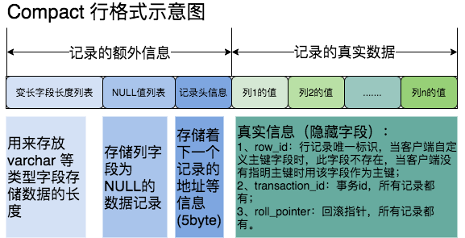

## 一、InnoDB行格式、数据页结构以及索引底层原理分析

### 1、局部性原理

​        在InnoDB中，数据会存储到磁盘上，在真正处理数据时需要先将数据加载到内存，表中读取某些记录时，InnoDB 存储引擎不需要一条一条的把记录从磁盘上读出来，InnoDB 采取的方式是：将数据划分为若干个页，以页作为磁盘和内存之间交互的基本单位，InnoDB中页的大小一般为 16 KB，也就是说，当需要从磁盘中读数据时每一次最少将从磁盘中读取16KB的内容到内存中，每一次最少也会把内存中的16KB内容写到磁盘中。

### 2、InnoDB 数据页结构

页是 InnoDB 管理存储空间的基本单位，一个页的大小默认是 16KB。

> SHOW GLOBAL STATUS like 'Innodb_page_size';

页结构：

**记录是单向链表结构：**记录的头信息中有 next_record 属性记录着下一个记录，记录是通过主键进行排序，每个记录存储着主键的下一个记录。

**数据页是双向链表结构：**File Header 中记录着页的上一页和下一页，从而串成了双向链表结构。

数据页会分成许多组，每个组中最后一个记录的偏移量作为**槽**，存放到 Page Directory 中，通过主键查找数据很快，步骤如下：

1. 先根据二分法查找到记录位于哪个槽中；
2. 在槽中遍历，找到具体的记录。

### 3、InnoDB 的行格式

InnoDB插入数据是已记录为单位进行的，记录在磁盘上的存储方式成为 行记录。

一行记录可以以不用的格式存放在InnoDB中，行格式分别为 Compact（常用）、Redundant、Dynamic 和 Compressed 行格式。

我们可以在创建或修改表的语句中指定行格式：

> CREATE TABLE 表名(列字段) ROW_FORMAT=行格式名称;
>
> ALTER TABLE 表名 ROW_FORMAT=行格式名称;

#### 3.1、Compact 行格式

##### 记录的额外信息

这部分信息是服务器为了描述这条记录而不得不额外添加的一些信息，这些额外信息分为三类，分别是：

* 变长字段长度列表

  * MySQL 支持一些变长的数据类型，比如：varchar(M)、varbinary(M)、text、blob类型，这些数据类型修饰列称为变长字段，变长字段中存储多少字节的数据不是固定的，所以我们在存储真实数据的时候需要顺便把这些数据占用的字节数也存起来。在 Compact 行格式中，把所有变长字段的真实数据占用的字节长度都存放在记录的开头部位，从而形成一个变长字段长度列表。

  * > char 是一种固定长度的类型，varchar则是一种可变长度的类型；
    >
    > varchar(M)，M 代表最大能存多少个字符。（MySQL5.0.3以前是字节，之后就是字符）

* NULL 值列表

  * Compact 行格式会把可以为 NULL 的列统一管理起来，存一个标记位在 NULL 值列表中，如果表中没有允许存储 NULL 的列，则 NULL 值列表也不存在。
    * 二进制位的值为1时，代表该列的值为NULL；
    * 二进制位的值为0时，代表该列的值不为NULL。

* 记录头信息

  * 大小固定为5个字节，即40bit

  * | 名称         | 大小（bit） | 描述                                                         |
    | ------------ | :---------- | :----------------------------------------------------------- |
    | 预留位1      | 1           | 没有使用                                                     |
    | 预留位2      | 1           | 没有使用                                                     |
    | delete_mask  | 1           | 标记该记录是否被删除                                         |
    | min_rec_mask | 1           | B+树的每层非叶子节点中的最小记录都会添加该标记               |
    | n_owned      | 4           | 表示当前记录拥有的记录数                                     |
    | heap_no      | 13          | 表示当前记录在记录堆的位置信息                               |
    | record_type  | 3           | 表示当前记录的类型，0-普通记录，1-B+树非叶子节点记录，2-最小记录，3-最大记录 |
    | next_record  | 16          | 表示下一条记录的相对位置                                     |

##### 记录的真实数据

记录的真实数据除了自定义的列数据之外，还包含三个隐藏列：

| 列名           | 是否必须 | 占用空间（字节） | 描述                   |
| -------------- | -------- | ---------------- | ---------------------- |
| row_id         | false    | 6                | 行ID，唯一标识一条记录 |
| transaction_id | true     | 6                | 事务ID                 |
| roll_pointer   | true     | 7                | 回滚指针               |

> 实际上这几个列的真正名称是：DB_ROW_ID、DB_TRX_ID、DB_ROLL_PTR。
>
> 一个表没有手动定义主键，则会选取一个Unique键作为主键，如果连Unique键都没有定义，则会为表默认添加一个名为row_id的隐藏列作为主键。所以row_id是在没有主键以及Unique键的情况下才会存在的。

#### 3.2、行溢出数据

