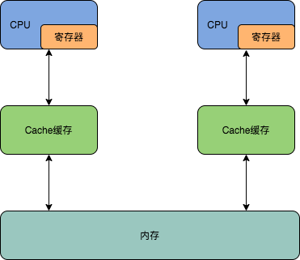
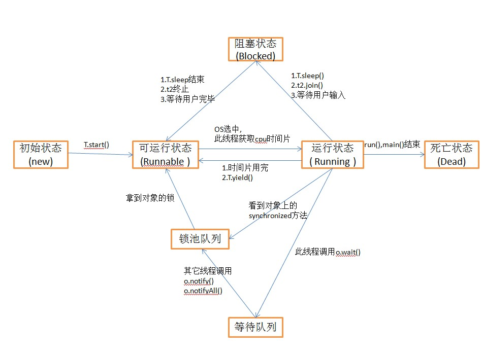

# 多线程知识点总结

## 1、并发编程的三要素

### 1.1、原子性

原子性指的是一个或者多个操作，要么全部执行并且在执行的过程中不被其他操作打断，要么就全部都不执行。

### 1.2、可见性

可见性指多个线程操作一个共享变量时，其中一个线程对变量进行修改后，其他线程可以立即看到修改的结果。

#### 1.2.1、为什么多线程情境下共享变量需要可见性

这里就需要先说明下硬件的内存架构



在多核心CPU的情境下，每个线程会有各自的寄存器跟程序计数器，用来存放当前线程的执行位置跟数据，而数据的获取是先通过缓存，再到内存的方式，若一个线程对共享变量的修改未通知到其他线程，那么其他线程访问共享变量时，还是通过访问缓存的方式，这就导致了数据不一致，所以需要可见性。

#### 1.2.2、可见性的实现方法

1）、volative

通过 MESI 缓存一致性协议来实现，思路是：当CPU写数据时，如果发现操作的变量是共享变量，即在其他CPU中也存在该变量的副本，那么他会发出信号通知其他CPU将该变量的缓存行设置为无效状态。当其他CPU使用这个变量时，首先会去嗅探是否有对该变量更改的信号，当发现这个变量的缓存行已经无效时，会从新从内存中读取这个变量。


2）、synchronized

- 线程解锁前，必须把共享变量的最新值刷新到主内存中

- 线程加锁时，将清空工作内存中共享变量的值，从而使用共享变量时需要从主内存中重新获取最新的值

通过以上两点，可以看到synchronized能够实现可见性。同时，由于synchronized具有同步锁，所以它也具有原子性

### 1.3、有序性

有序性，即程序的执行顺序按照代码的先后顺序来执行。

#### 1.3.1、为什么需要有序性

总所周知，CPU有两种工作状态：用户态跟内核态。

用户态不能直接使用系统资源，也不能改变CPU的工作状态，并且只能访问这个用户程序自己的存储空间；而内核态内核态可以使用计算机所有的硬件资源。

程序在运行过程中，会出现多次用户态跟内核态的转换，这种转换会消耗大量的CPU资源，为避免不必要的消耗，JVM会对程序进行指令重排序（编译器优化重排序、指令级并行重排序、内存系统重排序），但多线程情景下，指令重排序会导致数据不一致。

#### 1.3.2、系统底层如何实现有序性

1、内存屏障 sfence(写屏障)、 mfence(全屏障)、 lfence(读屏障)等系统原语

2、锁总线

hotspot底层使用 lock 指令来实现禁止指令重排序，锁总线的方式

#### 1.3.3、有序性的实现方法

##### volatile如何解决指令重排序

1）: 代码层次：volatile i

2）: 字节码层次：加了 ACC_VOLATILE 标志

3）: JVM层次：虚拟机规范要求使用 JVM的内存屏障

屏障两边的指令不可以重排！保障有序！

4）: hotspot实现

bytecodeinterpreter.cpp

```c++
int field_offset = cache->f2_as_index();
          if (cache->is_volatile()) {
            if (support_IRIW_for_not_multiple_copy_atomic_cpu) {
              OrderAccess::fence();
            }
```

orderaccess_linux_x86.inline.hpp

```c++
inline void OrderAccess::fence() {
  if (os::is_MP()) {
    // always use locked addl since mfence is sometimes expensive
#ifdef AMD64
    __asm__ volatile ("lock; addl $0,0(%%rsp)" : : : "cc", "memory");
#else
    __asm__ volatile ("lock; addl $0,0(%%esp)" : : : "cc", "memory");
#endif
  }
}
```

## 2、多线程的价值

2.1、发挥多核CPU的优势

2.2、防止阻塞，在单线程的情景下，若出现需要等待返回结果的，如同步请求数据，那么在等待回应的这段时间内，整个程序将处于阻塞状态。

2.3、处理大型计算任务，如建模，若能将整个大任务分成多个小任务，由多核CPU进行运算，将大大减少计算时间。

## 3、创建多线程的方式

1）继承 Thread 类，重写 run() 方法。

2）实现 Runnable 接口，重写 run() 方法。

3）实现 Callable 接口，重写 call() 方法。

### 3.1、三种方法的比较

1）、采用实现Runnable、Callable接口的方式创建多线程。

**优势是：**

线程类只是实现了Runnable接口或Callable接口，还可以继承其他类。

在这种方式下，多个线程可以共享同一个target对象，所以非常适合多个相同线程来处理同一份资源的情况，从而可以将CPU、代码和数据分开，形成清晰的模型，较好地体现了面向对象的思想。

**劣势是：**

编程稍微复杂，如果要访问当前线程，则必须使用Thread.currentThread()方法。

2）、使用继承Thread类的方式创建多线程

**优势是：**

编写简单，如果需要访问当前线程，则无需使用Thread.currentThread()方法，直接使用this即可获得当前线程。

**劣势是：**

线程类已经继承了Thread类，所以不能再继承其他父类。

3）、Runnable和Callable的区别

Callable规定（重写）的方法是call()，Runnable规定（重写）的方法是run()。

Callable的任务执行后可返回值，而Runnable的任务是不能返回值的。

Call方法可以抛出异常，run方法不可以。

运行Callable任务可以拿到一个Future对象，表示异步计算的结果。它提供了检查计算是否完成的方法，以等待计算的完成，并检索计算的结果。通过Future对象可以了解任务执行情况，可取消任务的执行，还可获取执行结果。

## 4、线程的状态



1）新建状态（New）：当线程对象对创建后，即进入了新建状态，如：Thread t = new MyThread()；

2）就绪状态（Runnable）：当调用线程对象的start()方法（t.start();），线程即进入就绪状态。处于就绪状态的线程，只是说明此线程已经做好了准备，随时等待CPU调度执行，并不是说执行了t.start()此线程立即就会执行；

3）运行状态（Running）：当CPU开始调度处于就绪状态的线程时，此时线程才得以真正执行，即进入到运行状态。注：就
绪状态是进入到运行状态的唯一入口，也就是说，线程要想进入运行状态执行，首先必须处于就绪状态中；

4）阻塞状态（Blocked）：处于运行状态中的线程由于某种原因，暂时放弃对CPU的使用权，停止执行，此时进入阻塞状态，直到其进入到就绪状态，才 有机会再次被CPU调用以进入到运行状态。

- 根据阻塞产生的原因不同，阻塞状态又可以分为三种：

  - 等待阻塞：运行状态中的线程执行wait()方法，使本线程进入到等待阻塞状态；

  - 同步阻塞 – 线程在获取synchronized同步锁失败(因为锁被其它线程所占用)，它会进入同步阻塞状态；

  - 其他阻塞 – 通过调用线程的sleep()或join()或发出了I/O请求时，线程会进入到阻塞状态。当sleep()状态超时、join()等待线程终止或者超时、或者I/O处理完毕时，线程重新转入就绪状态。

5）死亡状态（Dead）：线程执行完了或者因异常退出了run()方法，该线程结束生命周期。

## 5、线程池

### 5.1、ThreadPoolExecutor 参数介绍

> ThreadPoolExecutor(int corePoolSize,　int maximumPoolSize,　long keepAliveTime,　TimeUnit unit, 　BlockingQueue<Runnable> workQueue,　ThreadFactory threadFactory,　RejectedExecutionHandler handler)

**corePoolSize**：核心池的大小。在创建了线程池后，默认情况下，线程池中并没有任何线程，而是等待有任务到来才创建线程去执行任务，除非调用了prestartAllCoreThreads()或者prestartCoreThread()方法，从这2个方法的名字就可以看出，是预创建线程的意思，即在没有任务到来之前就创建corePoolSize个线程或者一个线程。默认情况下，在创建了线程池后，线程池中的线程数为0，当有任务来之后，就会创建一个线程去执行任务，当线程池中的线程数目达到corePoolSize后，就会把到达的任务放到缓存队列当中；

**maximumPoolSize**：线程池最大线程数。这个参数也是一个非常重要的参数，它表示在线程池中最多能创建多少个线程；

**keepAliveTime**：表示线程没有任务执行时最多保持多久时间会终止。默认情况下，只有当线程池中的线程数大于corePoolSize时，keepAliveTime才会起作用，直到线程池中的线程数不大于corePoolSize，即当线程池中的线程数大于corePoolSize时，如果一个线程空闲的时间达到keepAliveTime，则会终止，直到线程池中的线程数不超过corePoolSize。但是如果调用了allowCoreThreadTimeOut(boolean)方法，在线程池中的线程数不大于corePoolSize时，keepAliveTime参数也会起作用，直到线程池中的线程数为0；

**unit**：参数keepAliveTime的时间单位，有7种取值，在TimeUnit类中有7种静态属性

**workQueue**：一个阻塞队列，用来存储等待执行的任务，这个参数的选择也很重要，会对线程池的运行过程产生重大影响，一般来说，这里的阻塞队列有以下几种选择：ArrayBlockingQueue;　LinkedBlockingQueue;　SynchronousQueue;　PriorityBlockingQueue ArrayBlockingQueue和PriorityBlockingQueue使用较少，一般使用LinkedBlockingQueue和SynchronousQueue。线程池的排队策略与BlockingQueue有关。

**threadFactory**：线程工厂，主要用来创建线程

**handler**：表示当拒绝处理任务时的策略。有四种取值：

　AbortPolicy:丢弃任务并抛出RejectedExecutionException异常；

　DiscardPolicy：也是丢弃任务，但是不抛出异常

　DiscardOldestPolicy：丢弃队列最前面的任务，然后重新尝试执行任务（重复此过程）；

　CallerRunsPolicy：由调用线程处理该任务。

**线程池的执行过程如下：**

1. 首先检测线程池运行状态，如果不是RUNNING，则直接拒绝，线程池要保证在RUNNING的状态下执行任务。
2. 如果workerCount < corePoolSize，则创建并启动一个线程来执行新提交的任务。
3. 如果workerCount >= corePoolSize，且线程池内的阻塞队列未满，则将任务添加到该阻塞队列中。
4. 如果workerCount >= corePoolSize && workerCount < maximumPoolSize，且线程池内的阻塞队列已满，则创建并启动一个线程来执行新提交的任务。
5. 如果workerCount >= maximumPoolSize，并且线程池内的阻塞队列已满, 则根据拒绝策略来处理该任务, 默认的处理方式是直接抛异常。

### 5.2、newSingleThreadExecutor

```java
public static ExecutorService newSingleThreadExecutor() {
    return new FinalizableDelegatedExecutorService
        (new ThreadPoolExecutor(1, 1,
                                0L, TimeUnit.MILLISECONDS,
                                new LinkedBlockingQueue<Runnable>()));
}
```

创建一个单线程化的Executor，即只创建唯一的工作者线程来执行任务。

单工作线程最大的特点是可保证顺序地执行各个任务，并且在任意给定的时间不会有多个线程是活动的。

### 5.3、newFixedThreadPool

```java
public static ExecutorService newFixedThreadPool(int nThreads) {
    return new ThreadPoolExecutor(nThreads, nThreads,
                                  0L, TimeUnit.MILLISECONDS,
                                  new LinkedBlockingQueue<Runnable>());
}
```

Fixed [fɪkst]

创建一个定长线程池，可控制线程最大并发数，超出的线程会在队列中等待。

### 5.4、newCachedThreadPool

```java
public static ExecutorService newCachedThreadPool() {
    return new ThreadPoolExecutor(0, Integer.MAX_VALUE,
                                  60L, TimeUnit.SECONDS,
                                  new SynchronousQueue<Runnable>());
}
```

创建一个可缓存线程池，如果线程池长度超过处理需要，可灵活回收空闲线程，若无可回收，则新建线程。

SynchronousQueue阻塞队列的特点是只能存放一个任务，因此，newCachedThreadPool会在SynchronousQueue有任务时，就创建新线程，若线程任务执行完，1分钟内没有新的任务进来，则线程会自动终止。

缺陷是当有大量任务进来时，系统会创建大量的线程，导致系统瘫痪。

### 5.5、newScheduledThreadPool

```java
public static ScheduledExecutorService newScheduledThreadPool(int corePoolSize) {
    return new ScheduledThreadPoolExecutor(corePoolSize);
}

public ScheduledThreadPoolExecutor(int corePoolSize) {
    super(corePoolSize, Integer.MAX_VALUE, 0, NANOSECONDS,
          new DelayedWorkQueue());
}

public ThreadPoolExecutor(int corePoolSize,
                          int maximumPoolSize,
                          long keepAliveTime,
                          TimeUnit unit,
                          BlockingQueue<Runnable> workQueue) {
    this(corePoolSize, maximumPoolSize, keepAliveTime, unit, workQueue,
         Executors.defaultThreadFactory(), defaultHandler);
}
```

Scheduled [ˈskedʒuːld]

创建一个定长的线程池，而且支持定时的以及周期性的任务执行，支持定时及周期性任务执行。

### 5.6、线程池的优点

1）重用存在的线程，减少对象创建销毁的开销。

2）可有效的控制最大并发线程数，提高系统资源的使用率，同时避免过多资源竞争，避免堵塞。

3）提供定时执行、定期执行、单线程、并发数控制等功能。

