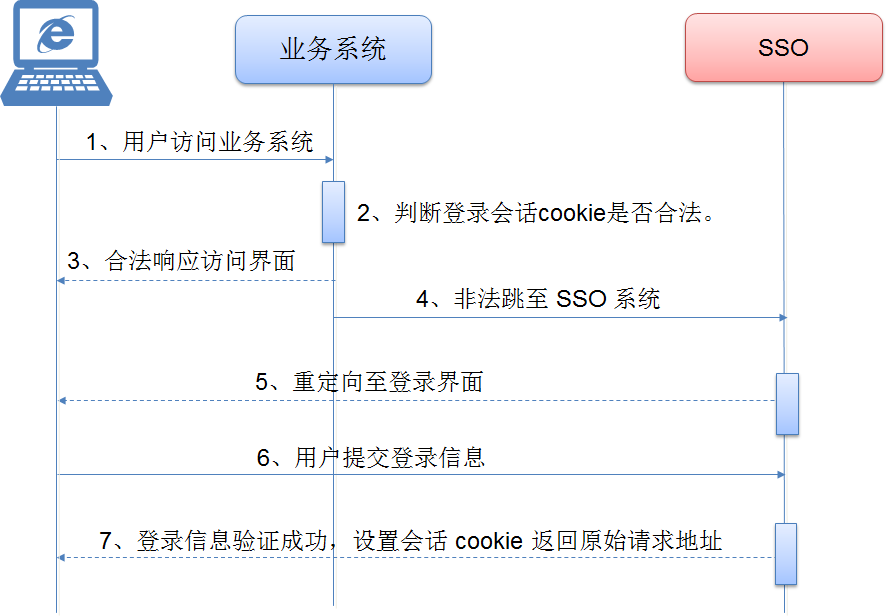

# Kisso 单点登录

## 介绍

 kisso 采用的是加密会话 cookie 机制实现单点登录 SSO 服务，具备“无状态”、“分散验证” 等特性。

1. session 存放在服务器端，cookie 存放在客户端，存在 2 种状态：“ 第一种：持久 cookie 具有时效性，以文件的形式存放在客户机硬盘中， 时间一到生命周期结束自动被删除。第二种：临时 cookie 又叫会话 cookie 放在浏览器 内存中，浏览器关闭生命周期结束自动失效 ”。
2. 单纯不做任何改变而言 session 更安全，如果 cookie 采取各种安全保护措施，此时的 cookie 一样安全。
3. cookie 轻松实现分布式服务部署，单点登录跨域访问等问题，换成 session 需要处理 session 复制及各种问题实现困难。

## KiSSO实现统一身份认证服务

### 验证流程

[](../img/1565249000266.png)

### 流程图

[](../img/login.png)

### 加Redis缓存

具体代码

```java
package com.baomidou.kisso.springmvc.cache;

import com.baomidou.kisso.SSOCache;
import com.baomidou.kisso.security.token.SSOToken;
import com.baomidou.kisso.springmvc.utils.RedisUtil;
import org.springframework.beans.factory.annotation.Autowired;

/**
 * @author 小贱
 * @create 2019-07-07 15:46
 */
public class RedisCache implements SSOCache {

    @Autowired
    RedisUtil redisUtil;

    @Override
    public SSOToken get(String s, int i) {
        if(exists(s)){
            String result = redisUtil.get(s);
            return  SSOToken.parser(result, false);
        }
        return null;
    }

    @Override
    public boolean set(String s, SSOToken token, int i) {
        boolean result = false;
        try {
            delete(s);
            redisUtil.set(s, token.getToken(), i);
            result = true;
        } catch (Exception e) {
            e.printStackTrace();
        }
        return result;

    }

    @Override
    public boolean delete(String s) {
        boolean result = false;
        try{
            if (exists(s)) {
                redisUtil.delete(s);
                return  true;
            }
        }catch (Exception e){
            e.printStackTrace();
        }
        return result;
    }

    public boolean exists(final String key) {
        return redisUtil.get(key)!=null;
    }
}
```

## 防 XSS 攻击 和 SQL 注入

### XSS简介

跨站脚本（cross site script）简称为XSS，是一种经常出现在web应用中的计算机安全漏洞，也是web中最主流的攻击方式。

XSS是指恶意攻击者利用网站没有对用户提交数据进行转义处理或者过滤不足的缺点，进而添加一些代码，嵌入到web页面中去，使别的用户访问都会执行相应的嵌入代码。

#### XSS攻击的危害

1、盗取用户资料，比如：登录帐号、网银帐号等

2、利用用户身份，读取、篡改、添加、删除企业敏感数据等

3、盗窃企业重要的具有商业价值的资料

4、非法转账

5、强制发送电子邮件

6、网站挂马

7、控制受害者机器向其它网站发起攻击

#### 防止XSS解决方案

 XSS的根源主要是没完全过滤客户端提交的数据 ，所以重点是要过滤用户提交的信息。将重要的 cookie 标记为 http only , 这样的话 js 中的 document.cookie 语句就不能获取到 cookie 了.

 只允许用户输入我们期望的数据。 例如：age用户年龄只允许用户输入数字，而数字之外的字符都过滤掉。对数据进行Html Encode 处理： 用户将数据提交上来的时候进行HTML编码，将相应的符号转换为实体名称再进行下一步的处理。

1. 过滤或移除特殊的Html标签， 例如: `, <iframe> , < for <, > for >, &quot for`

1. 过滤js事件的标签。例如 `“οnclick=”, “onfocus”`等等。

### SQL注入简介

 SQL注入是比较常见的网络攻击方式之一，主要是通过把SQL命令插入到Web表单递交或输入域名或页面请求的查询字符串，实现无帐号登录，甚至篡改数据库。

#### SQL注入的危害

1. 数据库信息泄漏：数据库中存放的用户的隐私信息的泄露。

2. 网页篡改：通过操作数据库对特定网页进行篡改。

3. 数据库被恶意操作：数据库服务器被攻击

4. 服务器被远程控制，被安装后门

5. 删除和修改数据库信息

#### 防止SQL注入的方式

 通常情况下，SQL注入的位置包括：

（1）表单提交，主要是POST请求，也包括GET请求；

（2）URL参数提交，主要为GET请求参数；

（3）Cookie参数提交；

（4）HTTP请求头部的一些可修改的值，比如Referer、User_Agent等；


#### 防止SQL注入的解决方案

（1）对用户的输入进行校验，使用正则表达式过滤传入的参数

（2）使用参数化语句，不要拼接sql，也可以使用安全的存储过程

（3）不要使用管理员权限的数据库连接，为每个应用使用权限有限的数据库连接

（4）检查数据存储类型

（5）重要的信息一定要加密

## **RSA 非对称加密**

### **RSA加密简介**

　　RSA加密是一种非对称加密。可以在不直接传递密钥的情况下，完成解密。这能够确保信息的安全性，避免了直接传递密钥所造成的被破解的风险。是由一对密钥来进行加解密的过程，分别称为公钥和私钥。两者之间有数学相关，该加密算法的原理就是对一极大整数做因数分解的困难性来保证安全性。通常个人保存私钥，公钥是公开的（可能同时多人持有）。

### RSA加密、签名区别

　　加密和签名都是为了安全性考虑，但略有不同。常有人问加密和签名是用私钥还是公钥？其实都是对加密和签名的作用有所混淆。简单的说，加密是为了防止信息被泄露，而签名是为了防止信息被篡改。这里举2个例子说明。

**第一个场景**：战场上，B要给A传递一条消息，内容为某一指令。

RSA的加密过程如下：

（1）A生成一对密钥（公钥和私钥），私钥不公开，A自己保留。公钥为公开的，任何人可以获取。

（2）A传递自己的公钥给B，B用A的公钥对消息进行加密。

（3）A接收到B加密的消息，利用A自己的私钥对消息进行解密。

　　在这个过程中，只有2次传递过程，第一次是A传递公钥给B，第二次是B传递加密消息给A，即使都被敌方截获，也没有危险性，因为只有A的私钥才能对消息进行解密，防止了消息内容的泄露。

**第二个场景：**A收到B发的消息后，需要进行回复“收到”。

RSA签名的过程如下：

（1）A生成一对密钥（公钥和私钥），私钥不公开，A自己保留。公钥为公开的，任何人可以获取。

（2）A用自己的私钥对消息加签，形成签名，并将加签的消息和消息本身一起传递给B。

（3）B收到消息后，在获取A的公钥进行验签，如果验签出来的内容与消息本身一致，证明消息是A回复的。

　　在这个过程中，只有2次传递过程，第一次是A传递加签的消息和消息本身给B，第二次是B获取A的公钥，即使都被敌方截获，也没有危险性，因为只有A的私钥才能对消息进行签名，即使知道了消息内容，也无法伪造带签名的回复给B，防止了消息内容的篡改。

　　但是，综合两个场景你会发现，第一个场景虽然被截获的消息没有泄露，但是可以利用截获的公钥，将假指令进行加密，然后传递给A。第二个场景虽然截获的消息不能被篡改，但是消息的内容可以利用公钥验签来获得，并不能防止泄露。所以在实际应用中，要根据情况使用，也可以同时使用加密和签名，比如A和B都有一套自己的公钥和私钥，当A要给B发送消息时，先用B的公钥对消息加密，再对加密的消息使用A的私钥加签名，达到既不泄露也不被篡改，更能保证消息的安全性。

　　**总结：公钥加密、私钥解密、私钥签名、公钥验签。**