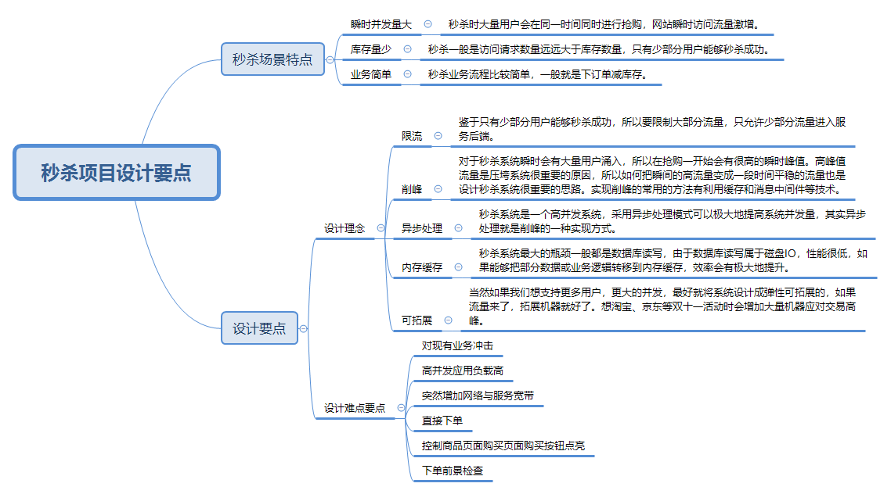
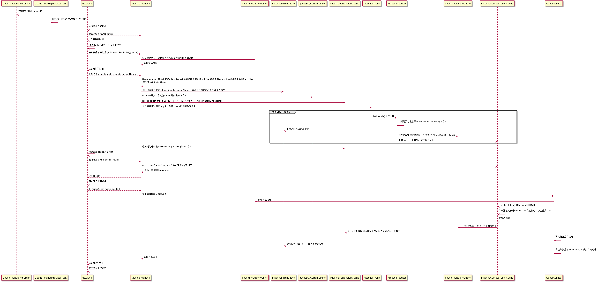
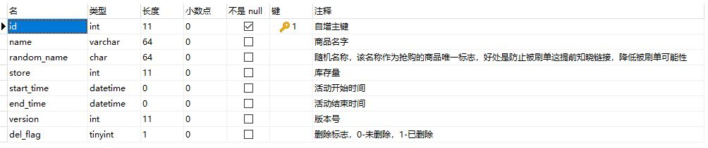
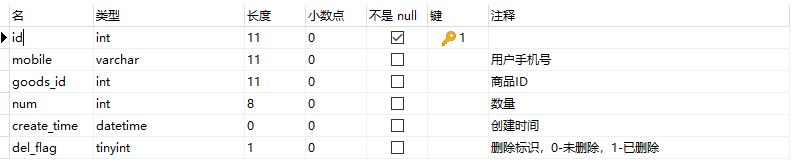
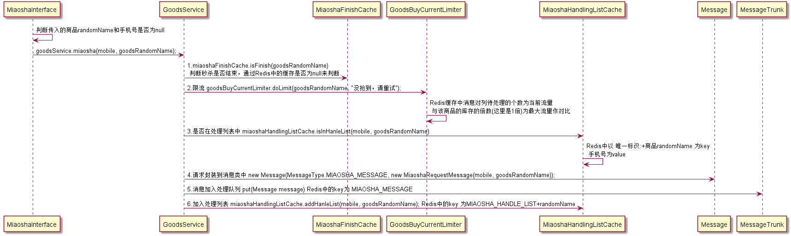
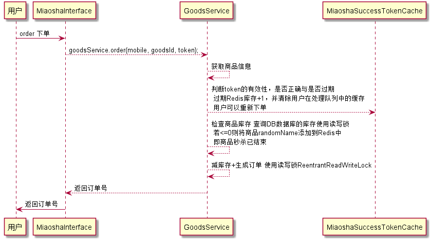

# 秒杀项目详解

## 前言

 所谓“秒杀”，就是网络卖家发布一些超低价格的商品，所有买家在同一时间网上抢购的一种销售方式。通俗一点讲就是网络商家为促销等目的组织的网上限时抢购活动。由于商品价格低廉，往往一上架就被抢购一空，有时只用一秒钟。

## 项目设计要点



## 项目流程

总的流程图



## 数据库设计

goods

[](../img/goodsSQL.JPG)

order

[](../img/orderSQL.JPG)

## 项目流程详解

### 定时任务

通过 `Spring` 的 `@Scheduled` 注解实现定时任务

#### GoodsRedisStoreInitTask 商品redis库存初始化任务

```java
/**
  *  每隔1分钟触发一次
  */
@Scheduled(cron = "0 0/1 * * * ? ")
public void doInit() {
   List<Goods> goods = goodsMapper.selectAll();
   for (Goods item : goods) {
       goodsRedisStore.doInit(item);
   }
}
// goodsRedisStore.doInit(item)
public void doInit(Goods goods) {
	String key = getKey(goods.getRandomName());
	// 如果没有初始化库存则初始化
	if (!redisUtil.exists(key)) {
	    redisUtil.set(key, goods.getStore() * 1);
    }
}
```

以 `REDIS_GOODS_STORE_GOODS_RANDOM_NAME:+商品唯一标识符` 为 key；商品库存 `store` 为 value。

#### GoodsTokenExpireClearTask 商品token过期清理任务

每当用户抢购成功都会生成 token ，而用户没有在规定的时间内下单支付就会过期，如果token存在，且是过期的，则 redis 库存 +1

```java
/**
 * 每隔1分钟触发一次
 */
@Scheduled(cron = "0 0/1 * * * ? ")
public void doClear() {
   Set<String> keys = miaoshaSuccessTokenCache.getAllToken();
   for(String key : keys){
      //验证token是否过期，过期了自动释放redis库存
      miaoshaSuccessTokenCache.validateTokenByKey(key);
   }
}
```

以 `MIAOSHA_SUCCESS_TOKEN_MOBILE:+手机号+_GOODS_RANDOM_NAME:+商品唯一标识符+_token` 为 key；`抢购成功时间` 为 value。

### 前端

获取商品列表和商品详情页就不介绍了，我们来说说商品抢购按钮URL的地址拼接

在前端页面中，会先判断用户是否登录，没有登录则会弹出登录窗口，然后获取系统当前时间，最后与商品的开始时间与结束时间进行比较，判断当前商品的状态：`1秒杀结束、2倒计时、3开始秒杀`

当秒杀开始时，通过ajax获取商品唯一标识 `randomName` 并显示秒杀按钮，点击秒杀按钮 会将 `randomName 和 手机号` 发送到后端，请求成功后开启定时查询抢购结果的方法。至此，秒杀的核心功能开始了

注：代码太多就不贴了，具体代码在 `webapp\resource\script\seckill.js` 中

### 秒杀

#### 恶意用户及IP拦截

##### UserInterceptor 恶意用户拦截

具体功能是：

1. 判断用户手机号是否在Redis用户黑名单缓存中，
2. 判断用户请求+1后是否达到黑名单要求，即1秒内访问次数超过10次
3. 都不符合则增加缓存，以 key：user_request_time_prefix + 手机号 ；value 为 访问时间 的list 类型。

##### IPInterceptor 恶意IP拦截

具体功能是：

> 获取真实IP
>
> request.getHeader("x-forwarded-for") : 10.47.103.13,4.2.2.2,10.96.112.230
>
> request.getHeader("X-Real-IP") : 10.47.103.13
>
> request.getRemoteAddr():10.96.112.230

1. 获取用户的真实IP，并判断IP是否正常
2. 判断IP是否在Redis的IP黑名单中
3. 判断请求+1后是否达到黑名单要求，即1秒内访问次数超过10次
4. 都不符合则增加缓存，以 key：ip_request_time_prefix + IP号 ；value 为 访问时间 的list 类型。

#### MiaoshaInterface.miaosha()

##### 秒杀方法部分流程图详解

[](../img/miaoshalittle.png)

这里面用到很多的Redis

| Redis            | key                            | value                        |
| :--------------- | :----------------------------- | :--------------------------- |
| 秒杀商品是否结束 | MIAOSHA_FINISH…+randomName     | null或者非null，null则未结束 |
| 消息对列         | MIAOSHA_MESSAGE                | Message                      |
| 处理列表         | MIAOSHA_HANDLE_LIST+randomName | 手机号                       |

##### 削锋

秒杀活动是希望更多的人来参与，也就是抢购之前希望有越来越多的人来看购买商品。

但是，在抢购时间达到后，用户开始真正下单时，秒杀的服务器后端缺不希望同时有几百万人同时发起抢购请求。

我们都知道服务器的处理资源是有限的，所以出现峰值的时候，很容易导致服务器宕机，用户无法访问的情况出现。

削峰从本质上来说就是更多地延缓用户请求，以及层层过滤用户的访问需求，遵从“最后落地到数据库的请求数要尽量少”的原则。

要对流量进行削峰，最容易想到的解决方案就是用消息队列来缓冲瞬时流量，把同步的直接调用转换成异步的间接推送，中间通过一个队列在一端承接瞬时的流量洪峰，在另一端平滑地将消息推送出去。

#### 消息对列（异步）

AbstarctMessageHandler 消息监听器 实现 Runnable 接口

```java
public abstract class AbstarctMessageHandler<T> implements Runnable
/**
 * 初始化启动本监听器
 */
@PostConstruct
public void startListen()
{
   // 启动监听
   new Thread(this).start();
}
```

run() 方法具体功能是 循环 listen() 方法

```java
public void run()
{
   while (true)
   {
      listen();
   }
}
```

listen() 方法

1. 阻塞的获取 Redis 中消息对列的值 key 为 MIAOSHA_MESSAGE，如果消息对列中没有值，则一直阻塞
2. 提交任务到线程池 ThreadPoolTaskExecutor ，核心功能交给子类 MiaoshaRequestHandler 的 handle 方法处理，如果处理失败，则判断失败次数，满足重试资格次数+1，并重新put到消息对列中。

MiaoshaRequestHandler.handle(message)

1. 判断用户是否在黑名单中
2. 判断抢购是否结束
3. 减 Redis 的库存 decr() 方法
4. 根据 手机号 和 商品randomName 生成 token ，并将token添加到Redis中。

注：这里的减库存操作不会影响到DB数据库

### 下订单

在上面的前端中说到 “请求成功后开启定时查询抢购结果的方法” ，该方法是通过Redis查询该手机号和商品randomName的token是否存在，存在则提供下单接口，执行下单功能

具体流程图

[](../img/order.png)

