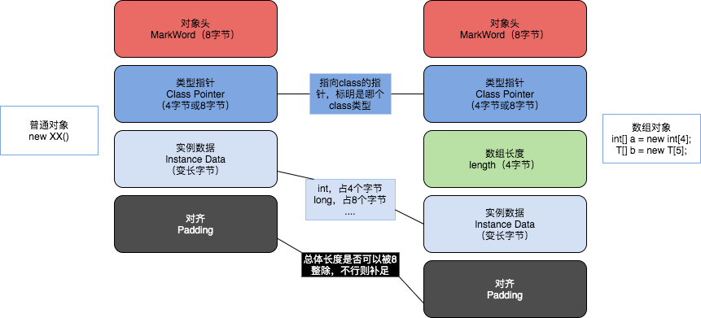
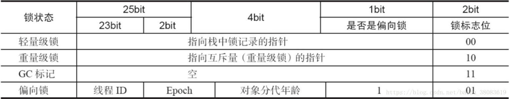

# CAS

Compare And Swap (Compare And Exchange) / 自旋 / 自旋锁 / 无锁 

因为经常配合循环操作，直到完成为止，所以泛指一类操作

cas(v, a, b) ，变量v，期待值a, 修改值b

ABA问题，你的女朋友在离开你的这段儿时间经历了别的人，自旋就是你空转等待，一直等到她接纳你为止

解决办法（版本号 AtomicStampedReference），基础类型简单值不需要版本号

# Unsafe

AtomicInteger:

```java
public final int incrementAndGet() {
        for (;;) {
            int current = get();
            int next = current + 1;
            if (compareAndSet(current, next))
                return next;
        }
    }

public final boolean compareAndSet(int expect, int update) {
        return unsafe.compareAndSwapInt(this, valueOffset, expect, update);
    }
```

Unsafe:

```java
public final native boolean compareAndSwapInt(Object var1, long var2, int var4, int var5);
```

运用：

```java
package com.mashibing.jol;

import sun.misc.Unsafe;

import java.lang.reflect.Field;

public class T02_TestUnsafe {

    int i = 0;
    private static T02_TestUnsafe t = new T02_TestUnsafe();

    public static void main(String[] args) throws Exception {
        //Unsafe unsafe = Unsafe.getUnsafe();

        Field unsafeField = Unsafe.class.getDeclaredFields()[0];
        unsafeField.setAccessible(true);
        Unsafe unsafe = (Unsafe) unsafeField.get(null);

        Field f = T02_TestUnsafe.class.getDeclaredField("i");
        long offset = unsafe.objectFieldOffset(f);
        System.out.println(offset);

        boolean success = unsafe.compareAndSwapInt(t, offset, 0, 1);
        System.out.println(success);
        System.out.println(t.i);
        //unsafe.compareAndSwapInt()
    }
}
```

jdk8u: unsafe.cpp:

cmpxchg = compare and exchange

```c++
UNSAFE_ENTRY(jboolean, Unsafe_CompareAndSwapInt(JNIEnv *env, jobject unsafe, jobject obj, jlong offset, jint e, jint x))
  UnsafeWrapper("Unsafe_CompareAndSwapInt");
  oop p = JNIHandles::resolve(obj);
  jint* addr = (jint *) index_oop_from_field_offset_long(p, offset);
  return (jint)(Atomic::cmpxchg(x, addr, e)) == e;
UNSAFE_END
```

jdk8u: atomic_linux_x86.inline.hpp

LOCK_IF_MP = Multi Processor  （如果是多个CPU）

cmpxchg: CompareAndExchange

```c++
inline jint     Atomic::cmpxchg    (jint     exchange_value, volatile jint*     dest, jint     compare_value) {
  int mp = os::is_MP();
  __asm__ volatile (LOCK_IF_MP(%4) "cmpxchgl %1,(%3)"
                    : "=a" (exchange_value)
                    : "r" (exchange_value), "a" (compare_value), "r" (dest), "r" (mp)
                    : "cc", "memory");
  return exchange_value;
}
```

jdk8u: os.hpp is_MP()

```c++
  static inline bool is_MP() {
    // During bootstrap if _processor_count is not yet initialized
    // we claim to be MP as that is safest. If any platform has a
    // stub generator that might be triggered in this phase and for
    // which being declared MP when in fact not, is a problem - then
    // the bootstrap routine for the stub generator needs to check
    // the processor count directly and leave the bootstrap routine
    // in place until called after initialization has ocurred.
    return (_processor_count != 1) || AssumeMP;
  }
```

jdk8u: atomic_linux_x86.inline.hpp

```c++
#define LOCK_IF_MP(mp) "cmp $0, " #mp "; je 1f; lock; 1: "
```

最终实现：

cmpxchg = cas修改变量值

```assembly
lock cmpxchg 指令
```

硬件：

lock指令在执行后面指令的时候锁定一个北桥信号

（不采用锁总线的方式）


# Java 对象在内存中的布局

使用 ` java -XX:+PrintFlagsInitial `查看JVM初始化完毕后所有参数


使用 java -XX:+PrintCommandLineFlags -version 命令行查看JVM参数

```c++
-XX:G1ConcRefinementThreads=4        // G1垃圾收集器的工作线程数
-XX:GCDrainStackTargetSize=64        // GC排泄堆栈目标大小
-XX:InitialHeapSize=268435456        // 起始堆大小
-XX:MaxHeapSize=4294967296           // 最大堆大小
-XX:+PrintCommandLineFlags           // 打印命令行标志
-XX:ReservedCodeCacheSize=251658240  // 预留代码缓存大小
-XX:+SegmentedCodeCache              // 分段代码缓存
-XX:+UseCompressedClassPointers      // 使用压缩指针（8字节会压缩成4字节）类型指针压缩
-XX:+UseCompressedOops               // 使用压缩普通对象指针 new String() 的指针压缩（OOP=Ordinary Object Poniter）
-XX:+UseG1GC                         // 使用G1垃圾收集器
java version "11.0.8" 2020-07-14 LTS
Java(TM) SE Runtime Environment 18.9 (build 11.0.8+10-LTS)
Java HotSpot(TM) 64-Bit Server VM 18.9 (build 11.0.8+10-LTS, mixed mode)
```





# markword

# 工具：JOL = Java Object Layout

```xml
<dependencies>
        <!-- https://mvnrepository.com/artifact/org.openjdk.jol/jol-core -->
        <dependency>
            <groupId>org.openjdk.jol</groupId>
            <artifactId>jol-core</artifactId>
            <version>0.9</version>
        </dependency>
    </dependencies>
```


jdk8u: markOop.hpp

```java
// Bit-format of an object header (most significant first, big endian layout below):
//
//  32 bits:
//  --------
//             hash:25 ------------>| age:4    biased_lock:1 lock:2 (normal object)
//             JavaThread*:23 epoch:2 age:4    biased_lock:1 lock:2 (biased object)
//             size:32 ------------------------------------------>| (CMS free block)
//             PromotedObject*:29 ---------->| promo_bits:3 ----->| (CMS promoted object)
//
//  64 bits:
//  --------
//  unused:25 hash:31 -->| unused:1   age:4    biased_lock:1 lock:2 (normal object)
//  JavaThread*:54 epoch:2 unused:1   age:4    biased_lock:1 lock:2 (biased object)
//  PromotedObject*:61 --------------------->| promo_bits:3 ----->| (CMS promoted object)
//  size:64 ----------------------------------------------------->| (CMS free block)
//
//  unused:25 hash:31 -->| cms_free:1 age:4    biased_lock:1 lock:2 (COOPs && normal object)
//  JavaThread*:54 epoch:2 cms_free:1 age:4    biased_lock:1 lock:2 (COOPs && biased object)
//  narrowOop:32 unused:24 cms_free:1 unused:4 promo_bits:3 ----->| (COOPs && CMS promoted object)
//  unused:21 size:35 -->| cms_free:1 unused:7 ------------------>| (COOPs && CMS free block)
```


# synchronized的横切面详解

1. synchronized原理
2. 升级过程
3. 汇编实现
4. vs reentrantLock的区别

## java源码层级

synchronized(o) 

## 字节码层级

monitorenter moniterexit

## JVM层级（Hotspot）

```java
package com.mashibing.insidesync;

import org.openjdk.jol.info.ClassLayout;

public class T01_Sync1 {
  

    public static void main(String[] args) {
        Object o = new Object();

        System.out.println(ClassLayout.parseInstance(o).toPrintable());
      
        synchronized (o) {
          System.out.println(ClassLayout.parseInstance(o).toPrintable());
        }
    }
}
```

```java
com.mashibing.insidesync.T01_Sync1$Lock object internals:
 OFFSET  SIZE   TYPE DESCRIPTION                               VALUE
      0     4   (object header)  05 00 00 00 (00000101 00000000 00000000 00000000) (5)
      4     4   (object header)  00 00 00 00 (00000000 00000000 00000000 00000000) (0)
      8     4   (object header)  49 ce 00 20 (01001001 11001110 00000000 00100000) (536923721)
     12     4        (loss due to the next object alignment)
Instance size: 16 bytes
Space losses: 0 bytes internal + 4 bytes external = 4 bytes total
```

```java
com.mashibing.insidesync.T02_Sync2$Lock object internals:
 OFFSET  SIZE   TYPE DESCRIPTION                               VALUE
      0     4   (object header)  05 90 2e 1e (00000101 10010000 00101110 00011110) (506368005)
      4     4   (object header)  1b 02 00 00 (00011011 00000010 00000000 00000000) (539)
      8     4   (object header)  49 ce 00 20 (01001001 11001110 00000000 00100000) (536923721)
     12     4        (loss due to the next object alignment)
Instance size: 16 bytes
Space losses: 0 bytes internal + 4 bytes external = 4 bytes tota
```

InterpreterRuntime:: monitorenter方法

```c++
IRT_ENTRY_NO_ASYNC(void, InterpreterRuntime::monitorenter(JavaThread* thread, BasicObjectLock* elem))
#ifdef ASSERT
  thread->last_frame().interpreter_frame_verify_monitor(elem);
#endif
  if (PrintBiasedLockingStatistics) {
    Atomic::inc(BiasedLocking::slow_path_entry_count_addr());
  }
  Handle h_obj(thread, elem->obj());
  assert(Universe::heap()->is_in_reserved_or_null(h_obj()),
         "must be NULL or an object");
  if (UseBiasedLocking) {
    // Retry fast entry if bias is revoked to avoid unnecessary inflation
    ObjectSynchronizer::fast_enter(h_obj, elem->lock(), true, CHECK);
  } else {
    ObjectSynchronizer::slow_enter(h_obj, elem->lock(), CHECK);
  }
  assert(Universe::heap()->is_in_reserved_or_null(elem->obj()),
         "must be NULL or an object");
#ifdef ASSERT
  thread->last_frame().interpreter_frame_verify_monitor(elem);
#endif
IRT_END
```

synchronizer.cpp

revoke_and_rebias

```c++
void ObjectSynchronizer::fast_enter(Handle obj, BasicLock* lock, bool attempt_rebias, TRAPS) {
 if (UseBiasedLocking) {
    if (!SafepointSynchronize::is_at_safepoint()) {
      BiasedLocking::Condition cond = BiasedLocking::revoke_and_rebias(obj, attempt_rebias, THREAD);
      if (cond == BiasedLocking::BIAS_REVOKED_AND_REBIASED) {
        return;
      }
    } else {
      assert(!attempt_rebias, "can not rebias toward VM thread");
      BiasedLocking::revoke_at_safepoint(obj);
    }
    assert(!obj->mark()->has_bias_pattern(), "biases should be revoked by now");
 }

 slow_enter (obj, lock, THREAD) ;
}
```

```c++
void ObjectSynchronizer::slow_enter(Handle obj, BasicLock* lock, TRAPS) {
  markOop mark = obj->mark();
  assert(!mark->has_bias_pattern(), "should not see bias pattern here");

  if (mark->is_neutral()) {
    // Anticipate successful CAS -- the ST of the displaced mark must
    // be visible <= the ST performed by the CAS.
    lock->set_displaced_header(mark);
    if (mark == (markOop) Atomic::cmpxchg_ptr(lock, obj()->mark_addr(), mark)) {
      TEVENT (slow_enter: release stacklock) ;
      return ;
    }
    // Fall through to inflate() ...
  } else
  if (mark->has_locker() && THREAD->is_lock_owned((address)mark->locker())) {
    assert(lock != mark->locker(), "must not re-lock the same lock");
    assert(lock != (BasicLock*)obj->mark(), "don't relock with same BasicLock");
    lock->set_displaced_header(NULL);
    return;
  }

#if 0
  // The following optimization isn't particularly useful.
  if (mark->has_monitor() && mark->monitor()->is_entered(THREAD)) {
    lock->set_displaced_header (NULL) ;
    return ;
  }
#endif

  // The object header will never be displaced to this lock,
  // so it does not matter what the value is, except that it
  // must be non-zero to avoid looking like a re-entrant lock,
  // and must not look locked either.
  lock->set_displaced_header(markOopDesc::unused_mark());
  ObjectSynchronizer::inflate(THREAD, obj())->enter(THREAD);
}
```

inflate方法：膨胀为重量级锁


# 锁升级过程


## JDK8 markword实现表：




无锁 - 偏向锁 - 轻量级锁 （自旋锁，自适应自旋）- 重量级锁

synchronized优化的过程和markword息息相关

用markword中最低的三位代表锁状态 其中1位是偏向锁位 两位是普通锁位

1. Object o = new Object()
   锁 = 0 01 无锁态 

2. o.hashCode()
   001 + hashcode

   ```java
   00000001 10101101 00110100 00110110
   01011001 00000000 00000000 00000000
   ```

   little endian big endian 

   00000000 00000000 00000000 01011001 00110110 00110100 10101101 00000000

3. 默认synchronized(o) 
   00 -> 轻量级锁
   默认情况 偏向锁有个时延，默认是4秒
   why? 因为JVM虚拟机自己有一些默认启动的线程，里面有好多sync代码，这些sync代码启动时就知道肯定会有竞争，如果使用偏向锁，就会造成偏向锁不断的进行锁撤销和锁升级的操作，效率较低。

   ```shell
   -XX:BiasedLockingStartupDelay=0
   ```

4. 如果设定上述参数
   new Object () - > 101 偏向锁 ->线程ID为0 -> Anonymous BiasedLock 
   打开偏向锁，new出来的对象，默认就是一个可偏向匿名对象101

5. 如果有线程上锁
   上偏向锁，指的就是，把markword的线程ID改为自己线程ID的过程
   偏向锁不可重偏向 批量偏向 批量撤销

6. 如果有线程竞争
   撤销偏向锁，升级轻量级锁
   线程在自己的线程栈生成LockRecord ，用CAS操作将markword设置为指向自己这个线程的LR的指针，设置成功者得到锁

7. 如果竞争加剧
   竞争加剧：有线程超过10次自旋， -XX:PreBlockSpin， 或者自旋线程数超过CPU核数的一半， 1.6之后，加入自适应自旋 Adapative Self Spinning ， JVM自己控制
   升级重量级锁：-> 向操作系统申请资源，linux mutex , CPU从3级-0级系统调用，线程挂起，进入等待队列，等待操作系统的调度，然后再映射回用户空间

(以上实验环境是JDK11，打开就是偏向锁，而JDK8默认对象头是无锁)

偏向锁默认是打开的，但是有一个时延，如果要观察到偏向锁，应该设定参数


没错，我就是厕所所长

加锁，指的是锁定对象

锁升级的过程

JDK较早的版本 OS的资源 互斥量 用户态 -> 内核态的转换 重量级 效率比较低

现代版本进行了优化

无锁 - 偏向锁 -轻量级锁（自旋锁）-重量级锁


偏向锁 - markword 上记录当前线程指针，下次同一个线程加锁的时候，不需要争用，只需要判断线程指针是否同一个，所以，偏向锁，偏向加锁的第一个线程 。hashCode备份在线程栈上 线程销毁，锁降级为无锁

有争用 - 锁升级为轻量级锁 - 每个线程有自己的LockRecord在自己的线程栈上，用CAS去争用markword的LR的指针，指针指向哪个线程的LR，哪个线程就拥有锁

自旋超过10次，升级为重量级锁 - 如果太多线程自旋 CPU消耗过大，不如升级为重量级锁，进入等待队列（不消耗CPU）-XX:PreBlockSpin


自旋锁在 JDK1.4.2 中引入，使用 -XX:+UseSpinning 来开启。JDK 6 中变为默认开启，并且引入了自适应的自旋锁（适应性自旋锁）。

自适应自旋锁意味着自旋的时间（次数）不再固定，而是由前一次在同一个锁上的自旋时间及锁的拥有者的状态来决定。如果在同一个锁对象上，自旋等待刚刚成功获得过锁，并且持有锁的线程正在运行中，那么虚拟机就会认为这次自旋也是很有可能再次成功，进而它将允许自旋等待持续相对更长的时间。如果对于某个锁，自旋很少成功获得过，那在以后尝试获取这个锁时将可能省略掉自旋过程，直接阻塞线程，避免浪费处理器资源。


偏向锁由于有锁撤销的过程revoke，会消耗系统资源，所以，在锁争用特别激烈的时候，用偏向锁未必效率高。还不如直接使用轻量级锁。

## synchronized最底层实现

```java

public class T {
    static volatile int i = 0;
    
    public static void n() { i++; }
    
    public static synchronized void m() {}
    
    public static void main(String[] args) {
        for(int j=0; j<10000000; j++) {
            m();
            n();
        }
    }
}

```

java -XX:+UnlockDiagonositicVMOptions -XX:+PrintAssembly T

C1 Compile Level 1 (一级优化)

C2 Compile Level 2 (二级优化)

找到m() n()方法的汇编码，会看到 lock comxchg .....指令

## synchronized vs Lock (CAS)

```
 在高争用 高耗时的环境下synchronized效率更高
 在低争用 低耗时的环境下CAS效率更高
 synchronized到重量级之后是等待队列（不消耗CPU）
 CAS（等待期间消耗CPU）
 
 一切以实测为准
```


# 锁消除 lock eliminate

```java
public void add(String str1,String str2){
         StringBuffer sb = new StringBuffer();
         sb.append(str1).append(str2);
}
```

我们都知道 StringBuffer 是线程安全的，因为它的关键方法都是被 synchronized 修饰过的，但我们看上面这段代码，我们会发现，sb 这个引用只会在 add 方法中使用，不可能被其它线程引用（因为是局部变量，栈私有），因此 sb 是不可能共享的资源，JVM 会自动消除 StringBuffer 对象内部的锁。

# 锁粗化 lock coarsening

```java
public String test(String str){
       
       int i = 0;
       StringBuffer sb = new StringBuffer():
       while(i < 100){
           sb.append(str);
           i++;
       }
       return sb.toString():
}
```

JVM 会检测到这样一连串的操作都对同一个对象加锁（while 循环内 100 次执行 append，没有锁粗化的就要进行 100  次加锁/解锁），此时 JVM 就会将加锁的范围粗化到这一连串的操作的外部（比如 while 虚幻体外），使得这一连串操作只需要加一次锁即可。

# 锁降级（不重要）

https://www.zhihu.com/question/63859501

其实，只被VMThread访问，降级也就没啥意义了。所以可以简单认为锁降级不存在！

# 超线程

一个ALU + 两组Registers + PC

# 参考资料

http://openjdk.java.net/groups/hotspot/docs/HotSpotGlossary.html

# 面试题

## 面试官：JVM对锁进行了优化，都优化了啥？

**小白**：从JDK1.5开始，JVM对锁进行了各种优化，目的就是为了在线程间更高效的共享数据和解决互斥同步的问题。从锁优化的话题开始，可以引申出很多考点面试题，比如锁优化的技术、各优化技术的细节、CAS实现原理、CAS的ABA问题及如何解决等，持续发散还会引发更多问题，例如逃逸分析等，可以看出技术点都是相关联的，需要不断积累和梳理。

## **面试官**：JVM实现了哪些锁优化技术？

**小白**：自旋锁、自适应自旋锁、锁粗化、锁消除、偏向锁、轻量级锁。

## **面试官**：介绍一下自旋锁？为什么引入自旋锁？

**小白**：自旋锁就是在请求获取锁，又不能马上获取到时，让当前线程在不放弃处理器执行时间的情况下执行忙循环，尝试等待锁被释放，再获取锁。引入自旋锁是为了节省线程挂起和恢复的开销。

## **面试官**：你刚刚说引入自旋锁节省了线程挂起和恢复的开销，但循环也是需要占用处理器时间的，那这个自旋的次数如何控制？

**小白**：默认是10次，也可以通过JVM参数-XX:PreBlockSpin配置，当然这些自旋都是固定的，所以JDK1.6引入了自适应自旋锁，自旋的次数由前一次在同一个锁上的自旋次数和锁的拥有者的状态来决定。如果前面线程成功获取锁并且正常运行，那么本次获取锁的可能性很大，所以自旋的次数相对多一些；如果前面线程很少成功获取锁，那么本次获取锁的概率也很小，就可能不执行自旋了。

## **面试官**：锁粗化优化了什么？

**小白**：如果在一段代码中同一线程反复获取、释放同一个对象的锁，将会生产不必要的性能开销，所以需要把获锁的范围扩大，对同一个对象的锁操作只进行一次，在头部获取锁，在尾部释放锁。

## **面试官**：锁消除是什么？

**小白**：锁消除是指JIT在运行时分析到使用了锁的同步代码在实际运行时不可能存在共享数据被竞争的情况，对锁进行去除。例如如果一个局部变量在方法内部不可能被外部引用，那么它就不需要加锁控制，可以去掉锁。*（注意：如果你的回答中提到了逃逸分析，面试官很有可能会问你什么是逃逸分析，提前做好准备）*

## **面试官**：详细说一下偏向锁？

**小白**：偏向锁就是如果线程持有了锁，在后续的过程中，只要该锁没有被其它线程持有，那么持有偏向锁的线程将不再需要进行同步操作。这个偏向锁的相关信息是保存在Java对象的对象头中的。在HotSpot虚拟机中，Java对象在内存中存储的布局分为3块区域：对象头、实例数据和对齐填充。对象头包含两部分，第一部分包含对象的HashCode、分代年龄、锁标志位、线程持有的锁、偏向线程ID等数据，这部分数据的长度在32位和64位虚拟机中分别为32bit和64bit，官方称为Mark World，用一张图展示不同状态下，对象头中存储的内容。


一个普通Java对象刚开始是处于无锁状态的，Mark World中存储的数据如上图中的第一行所示。当虚拟机启动了偏向锁，锁对象第一次被线程获取的时候，锁标识位置为01，同时使用CAS将获取到这个锁的线程ID设置到Mark World中，如果CAS操作成功，那么这个线程将可以继续执行相关的同步代码。如果此时有其它线程尝试获取锁，有两种情况，一种是锁对象未被锁定，则偏向锁被撤销，恢复到无锁状态；另一种是对象被锁定，那么偏向锁失效，同时升级为轻量级锁，会在当前线程的栈帧中创建一个锁记录的空间，这个空间存储对象头中Mark World的拷贝，就是复制一份到这个锁记录空间，同时虚拟机使用CAS尝试将这个锁记录空间的指针更新到Mark World，如果CAS操作成功，那么当前线程获取到锁，此时锁状态处于轻量级锁，锁标志位置为00。

## **面试官**：你刚刚说到虚拟机使用CAS进行更新操作，Java中的CAS是什么及如何实现的？

**小白**：CAS（Compare and swap）是比较和替换，是一种通过硬件实现并发安全的常用技术，底层通过利用CPU的CAS指令对缓存加锁或总线加锁的方式来实现多处理器之间的原子操作。它的实现过程是，有3个操作数，内存值V，旧的预期值E，要修改的新值U，当且仅当预期值E和内存值V相同时，才将内存值V修改为U，否则什么都不做。CAS底层实现使用了C++，在其代码中会根据操作系统和处理器的不同来选择对应的调用代码，以Windows和x86处理器为例，如果是多处理器，通过带lock前缀的cmpxchg指令对缓存加锁或总线加锁的方式来实现多处理器之间的原子操作；如果是单处理器，通过cmpxchg指令完成原子操作。

## **面试官**：那你知道CAS中的ABA问题吗？

**小白**：知道，CAS是当且仅当旧的预期值E和内存值V相同时，才将内存值V修改为U，也就是如果内存值V没有发生变化则更新，但是有可能发生内存值原来是A，中间被改成B，后来又被改成A，此时再使用CAS进行检查时发现没有变化，但是实际上发生了变化，这就是ABA问题。

## **面试官**：这个问题如何解决？

**小白**：Java并发包下的AtomicStampedReference可以解决ABA问题，内部实现上添加了一个类似于版本号作用的stamp属性，它是被自动更新的。实现上首先检查当前引用是否等于预期引用、当前stamp是否等于预期stamp，如果全部相等，则以原子方式将该引用和该stamp的值设置为给定的更新值。

