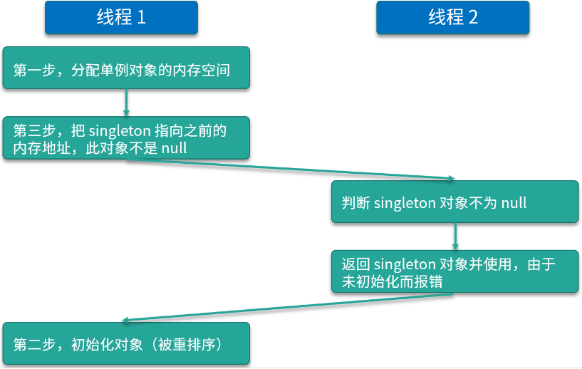
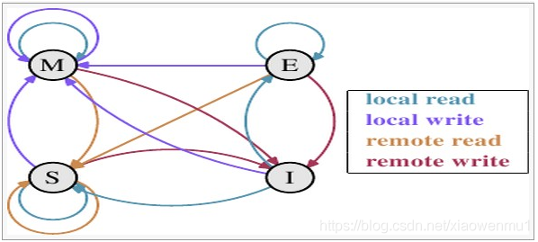
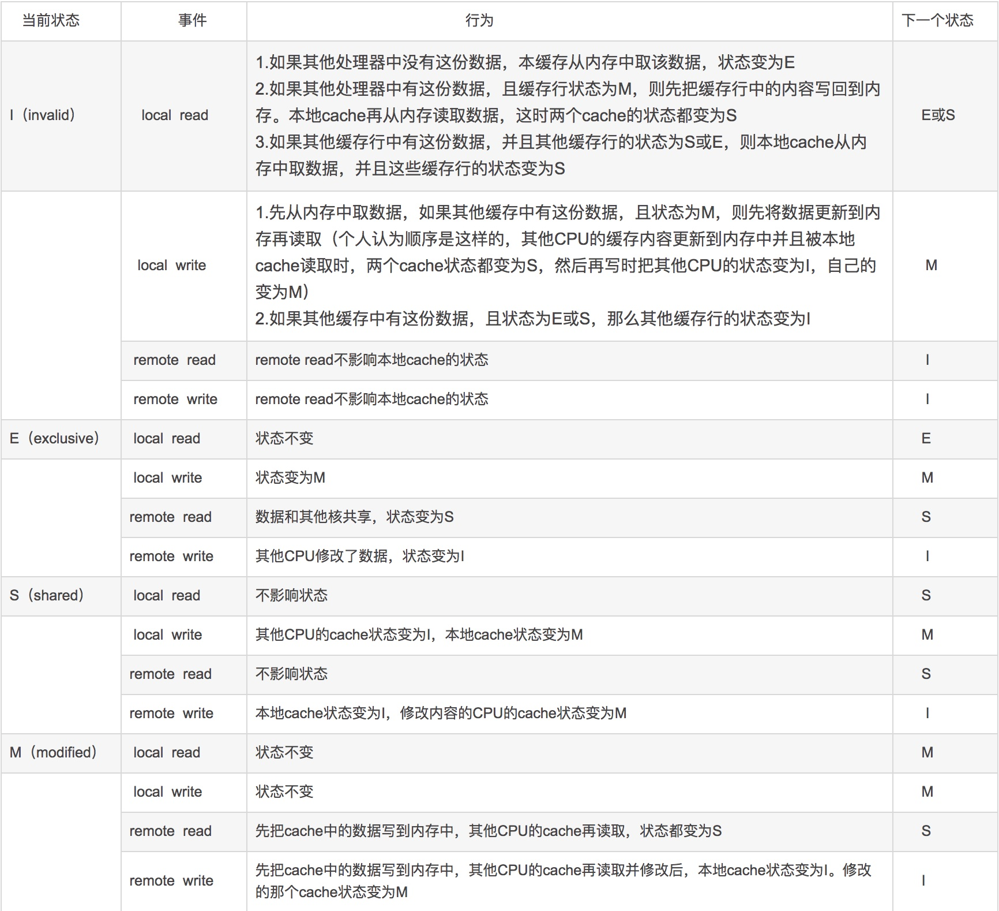

# volatile的用途

## 1.线程可见性

```java
package com.mashibing.testvolatile;

public class T01_ThreadVisibility {
    private static volatile boolean flag = true;

    public static void main(String[] args) throws InterruptedException {
        new Thread(()-> {
            while (flag) {
                //do sth
            }
            System.out.println("end");
        }, "server").start();


        Thread.sleep(1000);

        flag = false;
    }
}
```

## 2.防止指令重排序

### 问题：DCL单例需不需要加volatile？

```java
public class DoubleCheckLock {
    private volatile static DoubleCheckLock INSTANCE;
    private DoubleCheckLock() {
    }
    public static DoubleCheckLock getInstance() {
        if (INSTANCE == null) {
            synchronized (DoubleCheckLock.class) {
                if (INSTANCE == null) {
                    try {
                        Thread.sleep(1000);
                    } catch (InterruptedException e) {
                        e.printStackTrace();
                    }
                    INSTANCE = new DoubleCheckLock();
                }
            }
        }
        return INSTANCE;
    }
}
```

先试着解释下如果不加 volatile 会有什么问题，第一个线程过来，检查发现其他线程没有初始化然后就加上锁，上锁后对这个 INSTANCE 进行初始化，可是在这个过程中我们new 了这个对象并且申请了内存，申请完内存里边的成员变量已经赋了初始值 0，但这个时候 INSTANCE 就已经指向内存了，所以这个 INSTATNCE 已经不等于空了，这种情况下里一个线程来了，来了之后他首先执行 if (INSTANCE == null) ,这个时候他处于半初始化，不为空的状态，第二个线程就直接使用这个初始值了，而不是用那个默认值，解决这个问题就要加上volatile。

使用jclasslib查看getInstance方法的字节码，下面是 INSTANCE = new DoubleCheckLock(); 的字节码指令

```c
new
dup
invokespecial 
putstatic
```

- **new** 指令在java堆上为对象分配内存空间，并将地址压入操作数栈顶
- **dup** 指令为复制操作数栈顶值，并将其压入栈定，这是操作数栈有连续相同的两个对象地址
- **invokespecial** 调用实例的构造函数，这时会弹出一个栈顶元素
- **putstatic **指令将对象地址赋值给变量t，这时也会弹出一个栈顶元素

invokespecial指令与putstatic指令发生重排序，使这个INSTANTCE进行了半初始化，才会导致出现问题



### CPU的基础知识

* 缓存行对齐
  缓存行64个字节是CPU同步的基本单位，缓存行隔离会比伪共享效率要高
  Disruptor

  ```java
  package com.mashibing.juc.c_028_FalseSharing;
  
  public class T02_CacheLinePadding {
      private static class Padding {
          public volatile long p1, p2, p3, p4, p5, p6, p7; //
      }
  
      private static class T extends Padding {
          public volatile long x = 0L;
      }
  
      public static T[] arr = new T[2];
  
      static {
          arr[0] = new T();
          arr[1] = new T();
      }
  
      public static void main(String[] args) throws Exception {
          Thread t1 = new Thread(()->{
              for (long i = 0; i < 1000_0000L; i++) {
                  arr[0].x = i;
              }
          });
  
          Thread t2 = new Thread(()->{
              for (long i = 0; i < 1000_0000L; i++) {
                  arr[1].x = i;
              }
          });
  
          final long start = System.nanoTime();
          t1.start();
          t2.start();
          t1.join();
          t2.join();
          System.out.println((System.nanoTime() - start)/100_0000);
      }
  }
  
  ```

  ## MESI

  Modified：代表该缓存行中的内容被修改了，并且该缓存行只被缓存在该CPU中。这个状态的缓存行中的数据和内存中的不一样，在未来的某个时刻它会被写入到内存中（当其他CPU要读取该缓存行的内容时。或者其他CPU要修改该缓存对应的内存中的内容时（个人理解CPU要修改该内存时先要读取到缓存中再进行修改），这样的话和读取缓存中的内容其实是一个道理）
  
  Exclusive：代表该缓存行对应内存中的内容只被该CPU缓存，其他CPU没有缓存该缓存对应内存行中的内容。这个状态的缓存行中的内容和内存中的内容一致。该缓存可以在任何其他CPU读取该缓存对应内存中的内容时变成S状态。或者本地处理器写该缓存就会变成M状态。
  
  Shared：该状态意味着数据不止存在本地CPU缓存中，还存在别的CPU的缓存中。这个状态的数据和内存中的数据是一致的。当有一个CPU修改该缓存行对应的内存的内容时会使该缓存行变成 I 状态。
  
  Invalid：代表该缓存行中的内容时无效的。
  
  
  
* 伪共享
  
* 合并写
  CPU内部的4个字节的Buffer

  ```java
  package com.mashibing.juc.c_029_WriteCombining;
  
  public final class WriteCombining {
  
      private static final int ITERATIONS = Integer.MAX_VALUE;
      private static final int ITEMS = 1 << 24;
      private static final int MASK = ITEMS - 1;
  
      private static final byte[] arrayA = new byte[ITEMS];
      private static final byte[] arrayB = new byte[ITEMS];
      private static final byte[] arrayC = new byte[ITEMS];
      private static final byte[] arrayD = new byte[ITEMS];
      private static final byte[] arrayE = new byte[ITEMS];
      private static final byte[] arrayF = new byte[ITEMS];
  
      public static void main(final String[] args) {
  
          for (int i = 1; i <= 3; i++) {
              System.out.println(i + " SingleLoop duration (ns) = " + runCaseOne());
              System.out.println(i + " SplitLoop  duration (ns) = " + runCaseTwo());
          }
      }
  
      public static long runCaseOne() {
          long start = System.nanoTime();
          int i = ITERATIONS;
  
          while (--i != 0) {
              int slot = i & MASK;
              byte b = (byte) i;
              arrayA[slot] = b;
              arrayB[slot] = b;
              arrayC[slot] = b;
              arrayD[slot] = b;
              arrayE[slot] = b;
              arrayF[slot] = b;
          }
          return System.nanoTime() - start;
      }
  
      public static long runCaseTwo() {
          long start = System.nanoTime();
          int i = ITERATIONS;
          while (--i != 0) {
              int slot = i & MASK;
              byte b = (byte) i;
              arrayA[slot] = b;
              arrayB[slot] = b;
              arrayC[slot] = b;
          }
          i = ITERATIONS;
          while (--i != 0) {
              int slot = i & MASK;
              byte b = (byte) i;
              arrayD[slot] = b;
              arrayE[slot] = b;
              arrayF[slot] = b;
          }
          return System.nanoTime() - start;
      }
  }
  
  ```

  

* 指令重排序

  ```java
  package com.mashibing.jvm.c3_jmm;
  
  public class T04_Disorder {
      private static int x = 0, y = 0;
      private static int a = 0, b =0;
  
      public static void main(String[] args) throws InterruptedException {
          int i = 0;
          for(;;) {
              i++;
              x = 0; y = 0;
              a = 0; b = 0;
              Thread one = new Thread(new Runnable() {
                  public void run() {
                      //由于线程one先启动，下面这句话让它等一等线程two. 读着可根据自己电脑的实际性能适当调整等待时间.
                      //shortWait(100000);
                      a = 1;
                      x = b;
                  }
              });
  
              Thread other = new Thread(new Runnable() {
                  public void run() {
                      b = 1;
                      y = a;
                  }
              });
              one.start();other.start();
              one.join();other.join();
              String result = "第" + i + "次 (" + x + "," + y + "）";
              if(x == 0 && y == 0) {
                  System.err.println(result);
                  break;
              } else {
                  //System.out.println(result);
              }
          }
      }
  
  
      public static void shortWait(long interval){
          long start = System.nanoTime();
          long end;
          do{
              end = System.nanoTime();
          }while(start + interval >= end);
      }
  }
  ```


### 系统底层如何实现数据一致性

#### 1、MESI 如果能解决就使用 MESI

##### 缓存行的四个状态：

MESI中每个缓存行都有四个状态，分别是M（modified修改）、E（exclusive独占）、S（shared共享）、I（invalid无效）。下面我们介绍一下这四个状态分别代表什么意思。

M：代表该缓存行中的内容被修改了，并且该缓存行只被缓存在该CPU中。这个状态的缓存行中的数据和内存中的不一样，在未来的某个时刻它会被写入到内存中（当其他CPU要读取该缓存行的内容时。或者其他CPU要修改该缓存对应的内存中的内容时，需要先要读取到缓存中再进行修改，这样的话和读取缓存中的内容其实是一个道理。

E：E代表该缓存行对应内存中的内容只被该CPU缓存，其他CPU没有缓存该缓存对应内存行中的内容。这个状态的缓存行中的内容和内存中的内容一致。该缓存可以在任何其他CPU读取该缓存对应内存中的内容时变成S状态。或者本地处理器写该缓存就会变成M状态。

S:该状态意味着数据不止存在本地CPU缓存中，还存在别的CPU的缓存中。这个状态的数据和内存中的数据是一致的。当有一个CPU修改该缓存行对应的内存的内容时会使该缓存行变成 I 状态。

I：代表该缓存行中的内容时无效的。

##### EMSI状态转移图：



local read和local write分别代表本地CPU读写。remote read和remote write分别代表其他CPU读写。建议首次看EMSI内容的可以自己把下面这个表格写下来（我自己就是这么做的），这样理解会深一点。



#### 2、如果 MESI 不能，就使用 锁总线

### 系统底层如何保证有序性

1、内存屏障 sfence(写屏障)、 mfence(全屏障)、 lfence(读屏障)等系统原语

2、锁总线

hotspot底层使用 lock 指令来实现禁止指令重排序，锁总线的方式

### volatile如何解决指令重排序

#### 1: 代码层次：volatile i

#### 2: 字节码层次：加了 ACC_VOLATILE 标志

#### 3: JVM层次：虚拟机规范要求使用 JVM的内存屏障

屏障两边的指令不可以重排！保障有序！

#### 4: hotspot实现

bytecodeinterpreter.cpp

```c++
int field_offset = cache->f2_as_index();
          if (cache->is_volatile()) {
            if (support_IRIW_for_not_multiple_copy_atomic_cpu) {
              OrderAccess::fence();
            }
```

orderaccess_linux_x86.inline.hpp

```c++
inline void OrderAccess::fence() {
  if (os::is_MP()) {
    // always use locked addl since mfence is sometimes expensive
#ifdef AMD64
    __asm__ volatile ("lock; addl $0,0(%%rsp)" : : : "cc", "memory");
#else
    __asm__ volatile ("lock; addl $0,0(%%esp)" : : : "cc", "memory");
#endif
  }
}
```

