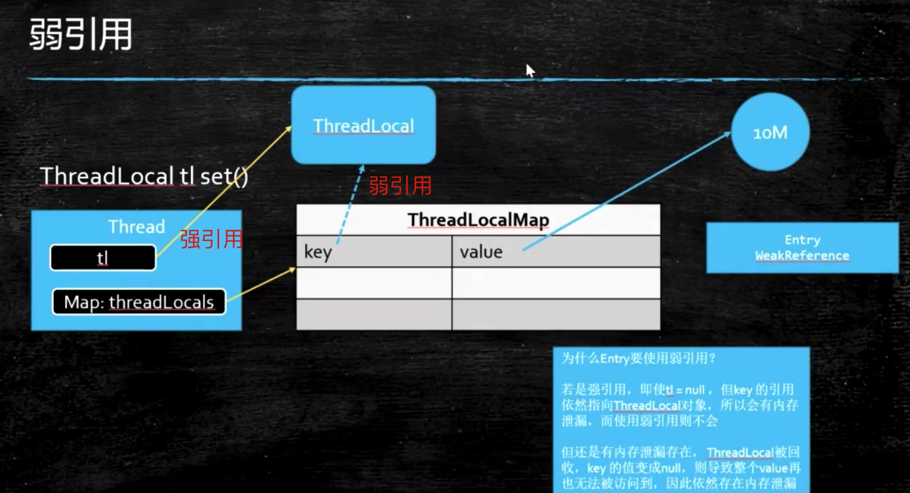

# 强软弱虚 JAVA中的引用类型

## ① 强引用

被强引用关联的对象不会被回收。

使用 new 一个新对象的方式来创建强引用。

```java
Object obj = new Object();
```

## ② 软引用

被软引用关联的对象只有在内存不够的情况下才会被回收。由JVM来控制是否回收。

使用 SoftReference 类来创建软引用。

```
Object obj = new Object();
SoftReference<Object> sf = new SoftReference<Object>(obj);
obj = null;  // 使对象只被软引用关联
```

## ③ 弱引用

被弱引用关联的对象一定会被回收，也就是说它只能存活到下一次垃圾回收发生之前。

使用 WeakReference 类来创建弱引用。

```
Object obj = new Object();
WeakReference<Object> wf = new WeakReference<Object>(obj);
obj = null;
```

## ④ 虚引用

又称为幽灵引用或者幻影引用，一个对象是否有虚引用的存在，不会对其生存时间造成影响，也无法通过虚引用得到一个对象。

为一个对象设置虚引用的唯一目的是能在这个对象被回收时收到一个系统通知。

使用 PhantomReference 来创建虚引用。

```
Object obj = new Object();
PhantomReference<Object> pf = new PhantomReference<Object>(obj, null);
obj = null;
```

作用：管理堆外内存

使用案例：NIO的zero拷贝

## 弱引用的使用

### ThreadLocal

spring 的事务管理

@Transactional

ThreadLoacal 的set方法

```java
public void set(T value) {
    Thread t = Thread.currentThread();
    ThreadLocalMap map = getMap(t);
    if (map != null) {
        map.set(this, value);
    } else {
        createMap(t, value);
    }
}

ThreadLocalMap getMap(Thread t) {
    return t.threadLocals;
}

ThreadLocal.ThreadLocalMap threadLocals = null;
```


ThreadLocalMap 的 entry 是一个 弱引用对象

```java
static class ThreadLocalMap {
    static class Entry extends WeakReference<ThreadLocal<?>> {
        Object value;
        Entry(ThreadLocal<?> k, Object v) {
            super(k);
            value = v;
        }
    }
```



因为当 tl 为null时，强引用断开，则ThreadLocalMap的key(ThreadLocal 弱引用)将在GC中清除，为null，但是 key-》null，value-》Object 仍然在ThreadLocalMap中存在，无法被回收，导致内存泄漏，因此，当tl无用时，需要调用 tl.remove() 方法，手动回收 value 的内存。