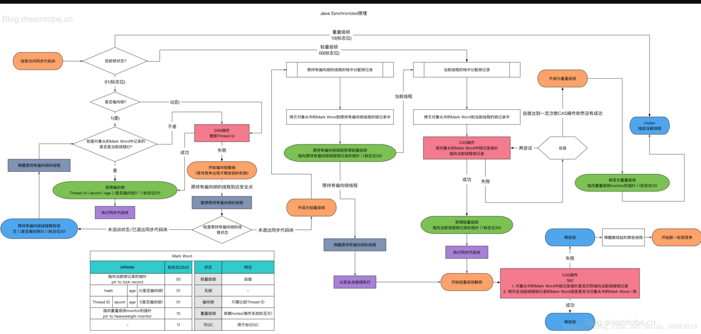

# 请描述synchronized和renntrantlock的底层实现及重入的底层原理

## synchronized 实现过程

- java代码：synchronized
  - .class文件内部   monitorenter   monitorexit
- 执行过程中自动升级
  - lock comxchg   （汇编语言  机器指令）

==================================================================

synchronized底层是基于JVM实现的

reentrantlock底层是基于AQS实现的

重入：reentrantlock有一个存放获取资源线程的对象，获取资源时会先判断当前线程与已获取资源的线程是否是同一个线程，若同样则资源数+1，重入

# 请描述锁的四种状态和升级过程

无锁                                                                  后3位  0 01     markword  64位

偏向锁                                                              后3位  1 01     markword  64位

轻量级锁（无锁、自旋锁、自适应自旋）    后2位     00     markword  64位

重量级锁                                                          后2位     10     markword  64位




# CAS的ABA问题如何解决

利用版本信息

若更新数据则版本信息+1

之后判断前后版本信息是否一致

# 请谈一下AQS，为什么AQS的底层是CAS+volatile

AQS是一种轻量级锁，

# 请谈一下你对volatile的理解

## 线程可见性


## 防止指令重排序


# volatile的可见性和禁止指令重排序是如何实现的

## 可见性

MESI 缓存一致性原则

## 禁止指令重

加一个内存屏障

JVM 的内存屏障

屏障的两边不允许指令重排


### JVM层面

```assembly
#必须上面读完了,你才能写
StoreStoreBarrier  # 写写屏障
volatile #写操作
StoreLoadBarrier  # 写读屏障
#必须写完了,你才能读
```

```assembly
#必须上面写完了,你才能读
LoadLoadBarrier  # 读读屏障
volatile #读操作
LoadStoreBarrier  # 读写屏障
#必须读完了,你才能写
```


# CAS是什么

原子性操作实现数据安全


# 请描述一下对象的创建过程

```java
class T{
    int m = 8;
}

T t = new T();
```

汇编码：

```assembly
0 new #2 <T>  // 按照对象大小分配内存   此时 int 默认为0
3 dup
4 invokespecial #3 <T.<init>>  // 特殊调用，调用对象的构造方法
7 astore_1   #//对像进行关联，t指向new出来的对象地址
8 return
```

1. 调用汇编码`new`指令，向内存申请空间，成员变量默认为0；
2. 执行到`invokespecial`指令，调用默认构造方法，成员变量赋值，m=8；
3. 执行`astore_1`指令，对对象进行关联，t 指向new出来的对象地址


# 对象在内存中的内存布局

12bytes -- markword

4bytes  --  classpoint

实例对象-Instance Data （int-4字节、long-8字节）

4bytes  --  填充字节

# DCL单例为什么要加volatile

利用volatile可以禁止指令重排序

对象的初始化过程

```java
class T{
    int m = 8;
}

T t = new T();
```

汇编码：

```assembly
0 new #2 <T>  // 按照对象大小分配内存   此时 int 默认为0
3 dup
4 invokespecial #3 <T.<init>>  // 特殊调用，调用对象的构造方法
7 astore_1   #//对像进行关联，t指向new出来的对象地址
8 return
```

1. 调用汇编码`new`指令，向内存申请空间，成员变量默认为0；
2. 执行到`invokespecial`指令，调用默认构造方法，成员变量赋值，m=8；
3. 执行`astore_1`指令，对对象进行关联，t 指向new出来的对象地址

当thread1 指向半初始化状态 `0 new #2 <T>`

JVM 指令重排

```assembly
7 astore_1   
4 invokespecial #3 <T.<init>> 
```

thread 2 进入判断 `if(t != null)  xxx ->` 使用了半初始化状态的对象

此时m==0；

==================================================================

单例就是只有一个对象

多线程情况下只操作一个对象

不能保证当一个cpu修改单例对象的后

另一个cpu获取的是最新的对象数据

添加volatile可以保证另一个cpu获取的是最新的对象数据

原因：

cpu有缓存

在双核时代，cpu普遍有3级缓存，每个cpu有一级、二级缓存，同时共享3级缓存

cpu缓存中存储的是 cache line 为64bytes

cpu每次从缓存中获取数据，没有再从内存中读，当添加 volatile 关键字时，cpu每修改一次，写入内存中后，会通知其他cpu要更新数据了，就会重新从内存中获取最新的对象数据。

# 解释一下锁的四种状态

无锁                                                                  后3位  0 01     markword  64位

偏向锁                                                              后3位  1 01     markword  64位

轻量级锁（无锁、自旋锁、自适应自旋）    后2位     00     markword  64位

重量级锁                                                          后2位     10     markword  64位


# Object o = new Object()在内存中占了多少字节

64位系统-----8字节，及从内存中都是8个字节的倍数取的

markword 占8个字节

classpointer  原占8个字节 但是JVM默认开启普通对象指针压缩，变成4个字节

Object 没有实例  后面为0

但是 8+4=12 不能被 8 整除

所以加4个字节的填充位------共16bytes

16 bytes

```java
com.mashibing.insidesync.T01_Sync1$Lock object internals:
 OFFSET  SIZE   TYPE DESCRIPTION                               VALUE
      0     4   (object header)  05 00 00 00 (00000101 00000000 00000000 00000000) (5)
      4     4   (object header)  00 00 00 00 (00000000 00000000 00000000 00000000) (0)
      8     4   (object header)  49 ce 00 20 (01001001 11001110 00000000 00100000) (536923721)
     12     4        (loss due to the next object alignment)
Instance size: 16 bytes
Space losses: 0 bytes internal + 4 bytes external = 4 bytes total
```

# 请描述synchronized和reentrantlock的异同


# 聊聊你对as-if-serial 和 happens-before 语义的理解

指令重排序的原则


# 你了解ThreadLocal吗？你知道ThreadLocal中如何解决内存泄漏问题吗？

## ThreadLocal

本地线程变量,相当一个容器,只能被自己的线程访问

> set() 方法

```java
public void set(T value) {
    Thread t = Thread.currentThread();
    ThreadLocalMap map = getMap(t); // t.threadLocals
    if (map != null)
        map.set(this, value);
    else
        createMap(t, value);
}
```

>  ThreadLocalMap -> Entry

key = ThreadLocal对象

value = 传进来的值


## 强、软、弱、虚引用

```java
public class M {
    // 垃圾回收器回收时执行
    @Override
    protected void finalize() throws Throwable {
        System.out.println("finalize");
    }
}
```

### 强引用 -- 普通引用

```java
public class T01_NormalReference {
    public static void main(String[] args) throws IOException {
        M m = new M();
        m = null;
        System.gc();

        System.in.read();
    }
}
```

只有当m 不指向 M 时, M才会被垃圾回收器回收


### 软引用 softReference

```java
public class T02_SoftReference {
    public static void main(String[] args) {
        SoftReference<byte[]> m = new SoftReference<>(new byte[1024*1024*10]);
        // m = null;
        System.out.println(m.get()); //[B@1540e19d
        System.gc();
        try {
            Thread.sleep(500);
        } catch (InterruptedException e) {
            e.printStackTrace();
        }
        System.out.println(m.get()); //[B@1540e19d
        
        // 再分配一个数组，heap将装不下，这时候系统会垃圾回收，先回收一次，如果不够，会把软引用回收
        byte[] b = new byte[1024*1024*15]; // JVM设置heap大小为20M；
        System.out.println(m.get()); // null
    }
}
```


### 弱引用 weakReference

```java
public class T03_WeakReference {
    public static void main(String[] args) {
        WeakReference<M> m = new WeakReference<>(new M());

        System.out.println(m.get()); //com.qrrxReference.M@1540e19d
        System.gc();
        System.out.println(m.get()); //null
      
        ThreadLocal<M> tl = new ThreadLocal<>();
        tl.set(new M());
        tl.remove(); //finalize
    }
}
```

只要gc就被回收


### 虚引用 phantomReference

```java
public class T04_PhantomReference {

    private static List<Object> LIST = new LinkedList<>();
    private static ReferenceQueue QUEUE = new ReferenceQueue();

    public static void main(String[] args) {
        PhantomReference<M> phantomReference = new PhantomReference<>(new M(), QUEUE);

        new Thread(() -> {
            while (true) {
                LIST.add(new byte[1024*1024]);
                try {
                    Thread.sleep(1000);
                } catch (InterruptedException e) {
                    e.printStackTrace();
                    Thread.currentThread().interrupt();
                }
                System.out.println(phantomReference.get()); // 一直为null
            }
        }).start();

        new Thread(() -> { // 监视gc线程
            while (true) {
                Reference<? extends M> poll = QUEUE.poll();
                if (poll != null) {
                    System.out.println("-----虚引用对被JVM回收了----" + poll);
                }
            }
        }).start();

        try {
            Thread.sleep(500);
        } catch (InterruptedException e) {
            e.printStackTrace();
        }

    }
}
```

虚引用主要用来跟踪对象被垃圾回收的活动。

只有一个作用: 管理堆外内存

当对象被回收时,通过Queue可以检测到, 然后清理堆外内存


虚引用时, 虚引用对象指向的是堆外内存, 当虚引用对象被回收时, 堆外内存没被回收, 造成内存泄漏.

所以, 定义 虚引用对象时, 需指定一个队列

```java
private static ReferenceQueue QUEUE = new ReferenceQueue();

PhantomReference<M> phantomReference = new PhantomReference<>(new M(), QUEUE);
```

当垃圾回收器准备回收一个对象时，如果发现它还有虚引用，就会在回收对象的内存之前，把这个虚引用加入到与之关联的引用队列中。


## 内存泄漏

使用弱引用指向存储的对象

弱引用一遇到gc就会被内存回收

```java
ThreadLocal<Persond> tl = new ThreadLocal();
```

tl 强引用 指向这个 ThreadLocal

> ThreadLocalMap  的key 通过 弱引用指向 这个 ThreadLocal

当 tl 不在指向这个ThreadLocal时, 一旦发生gc回收, 就会回收这个 ThreadLocal.

 tl 不在指向这个ThreadLocal时 需要调用 tl.remove(); 不然会发生内存泄漏


# 请描述一下锁的分类以及JDK中的应用

无锁                                                                  后3位  0 01     markword  64位

偏向锁                                                              后3位  1 01     markword  64位

轻量级锁（无锁、自旋锁、自适应自旋）    后2位     00     markword  64位

重量级锁                                                          后2位     10     markword  64位

