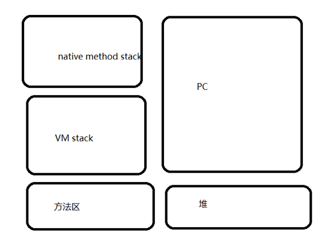
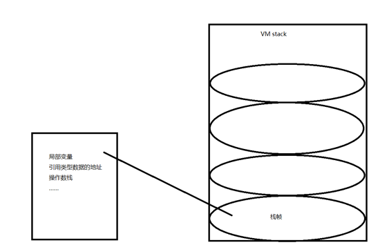
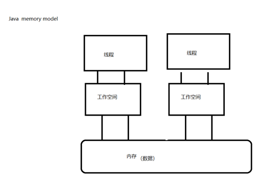
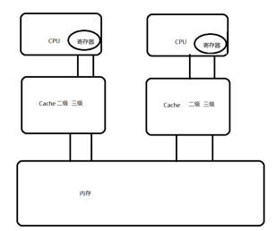
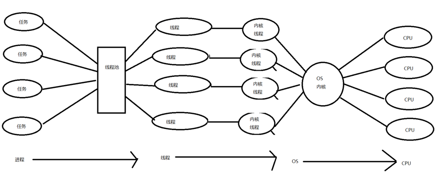
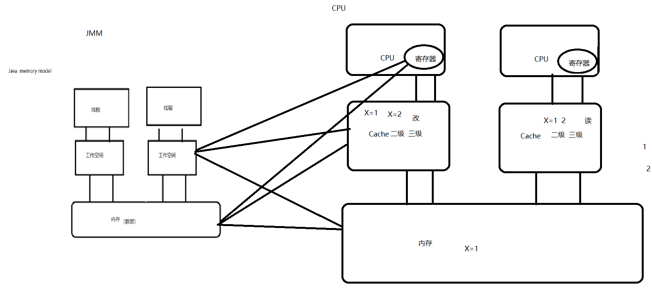

# Java内存模型

1、线程与JVM

2、java内存区域与java内存模型的区别

3、硬件内存架构与java内存模型

4、java内存模型对并发特征的保证

<!-- more -->

## 1 基本概念：

程序：代码，完成某一件任务，代码序列（静态的概念）

进程：程序在某些数据上的一次运行（动态的概念）

线程：一个进程可能包含一个或多个线程（占有资源的独立单元）

## 2 JVM与线程

JVM什么时候启动？

​        类被调用  JVM线程 ---》其他的线程（main）

线程在JVM中的运行情况？

​        钥匙口罩

## 3 JVM内存区域



方法区：类信息、常量、static 、JIT  （信息共享）

Java堆区：实例对象   GC  （信息共享）  (OOM)

VM stack：Java方法在运行的内存模型  (OOM)



PC：java线程的私有数据，这个数据就是执行下一条指令的地址 

Native method stack: 与JVM的native 

## 4 Java内存模型  Java memory model   JMM(规范,抽象的模型)



- 主内存：共享的信息
- 工作内存：私有信息，基本数据类型，直接分配到工作内存，引用的地址存放在工作内存，引用的对象存放在堆中
- 工作方式：
  - 线程修改私有数据，直接在工作空间修改
  - 线程修改共享数据，把数据复制到工作空间中去，在工作空间中修改，修改完成以后，刷新内存中的数据

   

## 5 硬件内存架构与java内存模型

- 硬件架构

  

  - CPU缓存的一致性问题：并发处理的不同步

  - 解决方案：

    - 总线加锁（） 降低CPU的吞吐量

    -  缓存上的一致性协议（MESI）

      - 当CPU在CACHE中操作数据时，如果该数据是共享变量，数据在CACHE读到寄存器中，进行新修改，并更新内存数据

      - CaCHE LINE置无效，其他的CPU就从内存中读数据

- Java线程与硬件处理器



- Java内存模型与硬件内存架构的关系



MESI 协议

​    交叉：数据的不一致

- Java内存模型的必要性
  - Java内存模型的作用：规范内存数据和工作空间数据的交互

## 6 并发编程的三个重要特性

- 原子性：不可分割 x=1

- 可见性：线程只能操作自己工作空间中的数据

- 有序性：程序中的顺序不一定就是执行的顺序
  - 编译重排序  ==>  提高效率
  - 指令重排序  ==>  提高效率

```java
/**
 * as-if-seria:单线程中重排后不影响执行的结果，多线程。
 * happens-before
 */
```


## 7 JMM对三个特征的保证

- JMM与原子性
  - x=10 写 原子性  如果是私有数据具有原子性，如果是共享数据没原子性（读写）
  - y=x 没有原子性
    - 把数据 x 读到工作空间（原子性）
    - 把 x 的值写到 y（原子性）
  - i++ 没有原子性
    - 读i到工作空间
    - +1；
    - 刷新结果到内存
  - z=z+1 没有原子性
    - 读z到工作空间
    - +1；
    - 刷新结果到内存

  多个原子性的操作合并到一起没有原子性

  ​	保证方式：

  ​			synchronized

  ​			JUC  Lock 的 lock

 

- JMM与可见性
  - volatile: 在 JMM 模型上实现 MESI 协议
  -  synchronized:加锁
  - JUC  JUC  Lock 的 lock

  

- JMM与有序性

  - Volatile：
  - Synchronized：

  Happens-before原则：

  ​	1)  程序次序原则

  ​	2）锁定原则 ：后一次加锁必须等前一次解锁

  ​	3）Volatile原则：霸道原则

  ​	4）传递原则：A---B ---C  A--C

****

总结：

JVM内存区域和JMM的关系

JMM和硬件的关系

JMM和并发编程三个重要特征（有序性 as-if-seria  happens-before ）

 